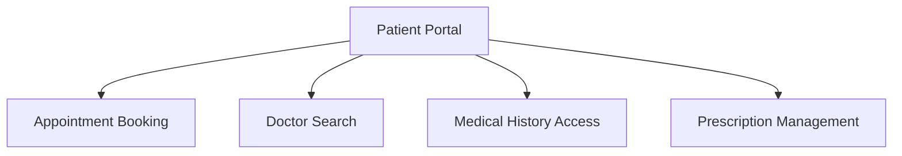
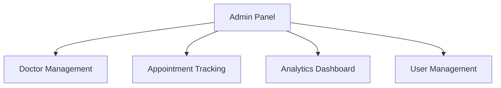
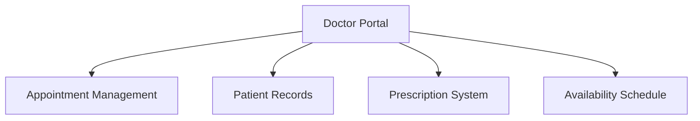
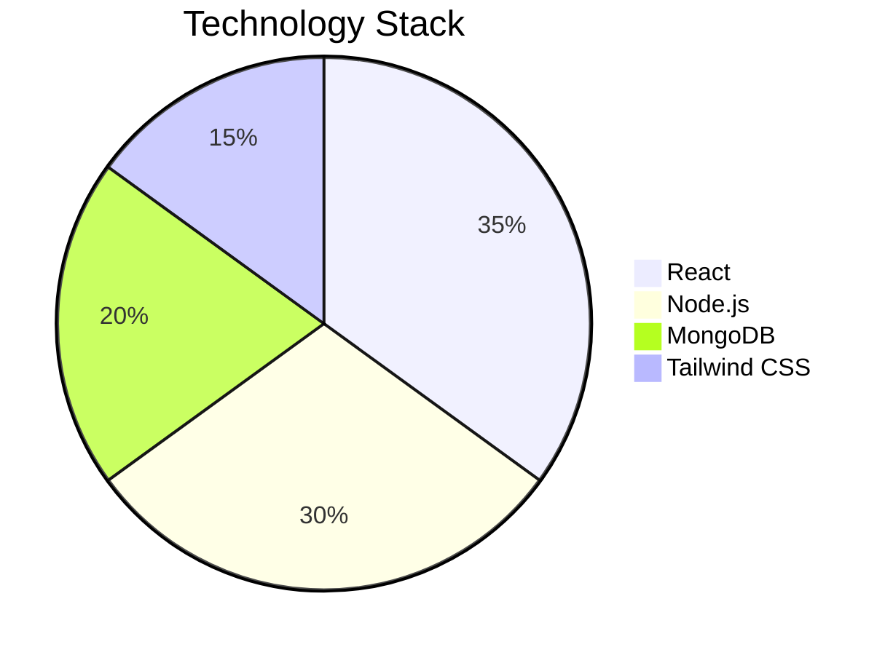
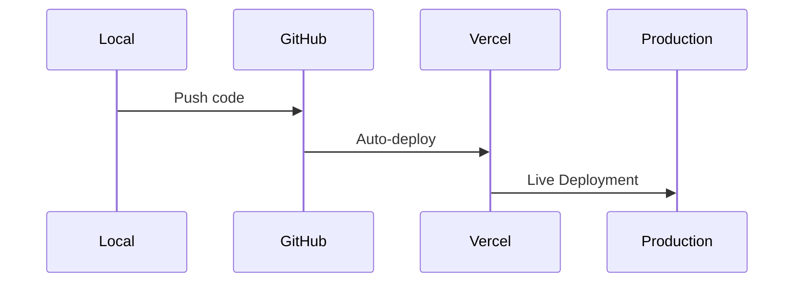

# MediZen Healthcare Platform 🏥

A full-stack healthcare management system connecting patients, doctors, and administrators.

## Live Demos 🌐
- **Patient Portal**: [medisin.vercel.app](https://medisin.vercel.app)
- **Admin/Doctor Panel**: [medisin-panel.vercel.app](https://medisin-panel.vercel.app)

## Features ✨

### Patient Features


### Admin Features


### Doctor Features


## Tech Stack 💻



## Installation 🛠️

### Prerequisites
- Node.js ≥16.x
- MongoDB Atlas account
- Cloudinary account

### Setup Steps

1. **Clone Repository**
```bash
git clone https://github.com/your-username/medizen.git
cd medizen
```

2. **Backend Setup**
```bash
cd backend
npm install
cp .env.example .env
# Fill environment variables
npm start
```

3. **Frontend Setup (Patient)**
```bash
cd frontend
npm install
cp .env.example .env
npm run dev
```

4. **Admin Panel Setup**
```bash
cd admin
npm install
cp .env.example .env
npm run dev
```

## Environment Variables 🔒

Create `.env` files with these variables:

**Backend**
```env
MONGODB_URI=your_mongodb_uri
JWT_SECRET=your_jwt_secret
CLOUDINARY_CLOUD_NAME=your_cloud_name
CLOUDINARY_API_KEY=your_api_key
CLOUDINARY_API_SECRET=your_api_secret
ADMIN_SECRET_KEY=your_admin_secret
```

**Frontend**
```env
VITE_BACKEND_URL=your_backend_url
```

## Deployment 🚀



## Contributing 🤝
1. Fork the repository
2. Create your feature branch (`git checkout -b feature/amazing-feature`)
3. Commit your changes (`git commit -m 'Add amazing feature'`)
4. Push to the branch (`git push origin feature/amazing-feature`)
5. Open a Pull Request

## License 📄
This project is licensed under the MIT License - see the [LICENSE](LICENSE) file for details.
